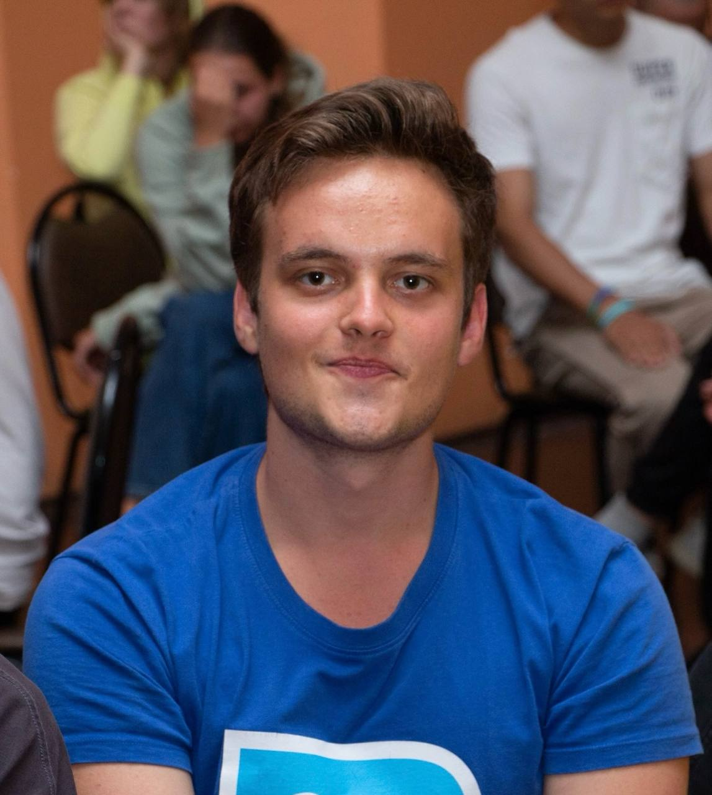

# Командный проект по курсу 8 семестра МГТУ им. Н. Э. Баумана "Технология командной разработки ПО".


Веб-приложение для управления расписанием и электронными очередями на сдачу работ в рамках учебного процесса.

## Быстрый старт (локальный запуск)

1.  **Клонируйте репозиторий:**
    ```bash
    git clone https://github.com/your-org/your-repo.git
    cd your-repo
    ```

2.  **Настройте переменные окружения:**
    Скопируйте `.env.example` в `.env` и заполните необходимые значения.
    ```bash
    cp .env.example .env
    ```

3.  **Запустите проект с помощью Docker:**
    ```bash
    docker-compose up --build
    ```

4.  Приложение будет доступно по адресам:
    *   **Frontend:** `http://localhost:3000`
    *   **Backend API:** `http://localhost:8080/api/v1`

## Ключевые ссылки

*   **Трекер задач (Issues):** https://github.com/orgs/SVIN-Team/projects/2/views/1
*   **Staging окружение:** `https://staging.example.com`
*   **Production окружение:** `https://example.com`

## Документация проекта

*   📖 **[Как начать работу над проектом (CONTRIBUTING.md)](./CONTRIBUTING.md)** — правила для разработчиков, модель ветвления, регламент коммитов.

*   📂 **[Подробная документация проекта (docs/)](./docs/)**:
    *   **[ТЗ](./docs/tz.md)**: цели, роли пользователей, глоссарий.
    *   **[Спецификация API](./docs/endpoints.md)**: все эндпоинты, запросы и ответы.

## Авторы проекта
| Фотография | Имя | Роль в проекте | Связь |
| :---: | :--- | :--- | :--- |
|  | **Могилин Никита** | Backend-разработчик (Go) | [GitHub](https://github.com/Nok1o) |
|  | **Прошин Илья** | Backend-разработчик (Go) | [GitHub](https://github.com/Kukushenok) |
|  | **Ломовская Софья** | Backend-разработчик (Go) | [GitHub](https://github.com/sofjabo) |
|  | **Лукьяненко Владислав** | Backend-разработчик (Go) | [GitHub](https://github.com/Vladragone) |
